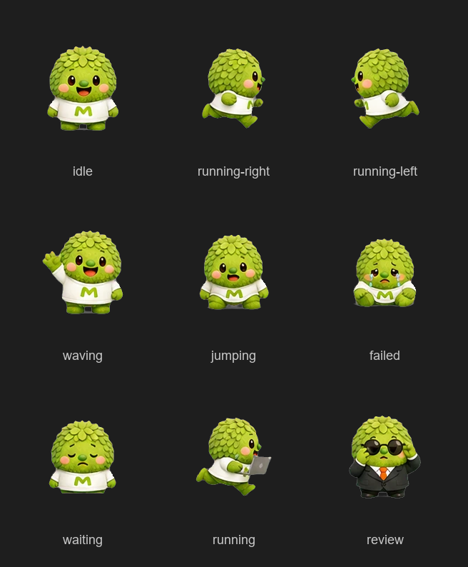

# MOSS Mascot — Codex Desktop Pet

A green fuzzy MOSS-style desktop mascot for [OpenAI Codex](https://github.com/openai/codex).  
White shirt with an **M** mark, rosy cheeks, 9 animation states — including a sunglasses suit *review* mode.



---

## Install

### Ask Codex to install it

Just tell Codex:

```
Install the pet from https://github.com/0xagata-prog/moss-mascot-codex-pet
```

Or paste this prompt directly:

```
Run this in PowerShell:
irm https://raw.githubusercontent.com/0xagata-prog/moss-mascot-codex-pet/main/install.ps1 | iex
```

### Windows — one line

Open PowerShell and run:

```powershell
irm https://raw.githubusercontent.com/0xagata-prog/moss-mascot-codex-pet/main/install.ps1 | iex
```

### macOS / Linux — one line

```sh
curl -fsSL https://raw.githubusercontent.com/0xagata-prog/moss-mascot-codex-pet/main/install.sh | sh
```

Then **fully restart Codex** and go to **Settings → Appearance → Pet**, select `MOSS Mascot`.

---

## Animation States

| Row | State           | Frames | FPS |
|-----|-----------------|--------|-----|
| 1   | `idle`          | 6      | 6   |
| 2   | `running-right` | 8      | 12  |
| 3   | `running-left`  | 8      | 12  |
| 4   | `waving`        | 4      | 8   |
| 5   | `jumping`       | 5      | 10  |
| 6   | `failed`        | 8      | 8   |
| 7   | `waiting`       | 6      | 6   |
| 8   | `running`       | 6      | 12  |
| 9   | `review`        | 6      | 8   |

Spritesheet: `192x208` per frame, 8 columns x 9 rows (`1536x1872` total).

---

## License

MIT — feel free to use, modify, and share.
